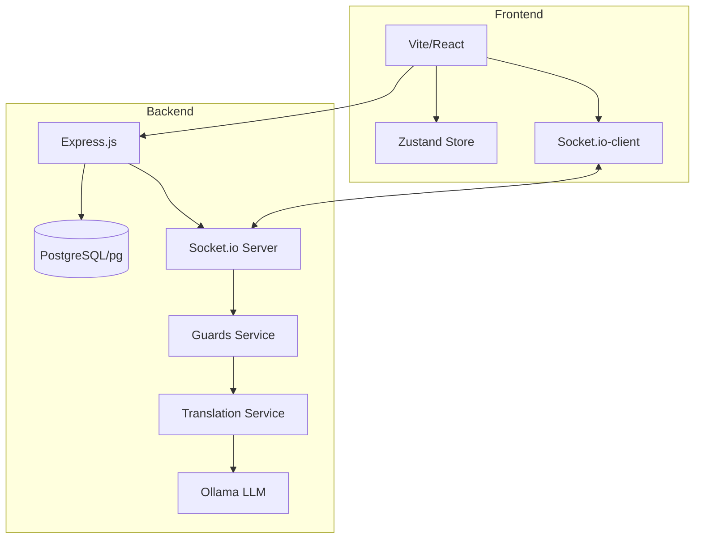
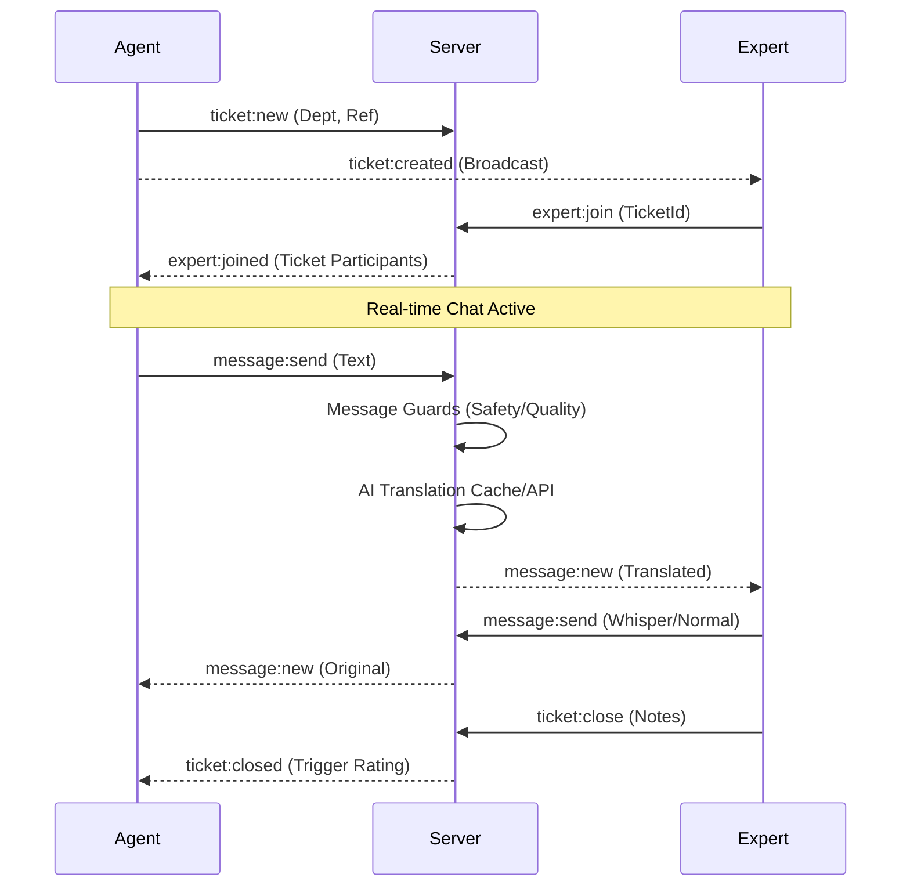

# System Architecture: M&P Support

This document provides a deep dive into the system design, data flows, and modular components of the M&P Support application. For dependencies and technical stack details, see [TECH_STACK.md](./TECH_STACK.md).

## High-Level Overview

The application follows a real-time, event-driven architecture designed for high availability and low latency in customer support scenarios.

## Real-Time Engine (Socket.io)

Real-time interactions are the core of the support experience. The server handles room management, broadcast logic, and background processing.

### Event Flow: Ticket Creation to Resolution

## AI & Translation Pipeline

To handle multi-language support (EN, NL, FR) without heavy API costs, the system uses a localized AI strategy.

1. **Translation Service**:
   - Checks `translations_cache` first.
   - Fallback to local **Ollama** REST API (Gemma Model).
   - Graceful degradation to original text if AI is unreachable.

2. **Sentiment & Summarization**:
   - The Admin Dashboard triggers background summarization of ticket batches to identify recurring issues.

## Modular Dashboard Architecture

The **Admin View** and **Expert View** use a highly modular "cockpit" approach.

- **Orchestration**: Layouts are managed by role-specific views (`AdminView.jsx`, `ExpertView.jsx`).
- **Plugins**: Features like `StatsOverview`, `PerformanceTrends`, and `Labels` are independent components that subscribe to the global store.
- **Cognitive Tools**: Accessibility features (Dyslexic font, Bionic reading highlighting) are applied globally via a root wrapper observing the store.

## Data Lifecycle & Compliance (GDPR)

The system manages a hybrid data model to balance historical analysis with privacy compliance.

1. **Live Data (Last 30 Days)**: All tickets, messages, and ratings are stored with full detail.
2. **Purge Cycle**: Every 24 hours, the server identifies "expired" data.
3. **Anonymized Aggregation**: Before deletion, key metrics (volumes, response times, ratings) are summarized into the `daily_stats` table.
4. **Permanent Storage**: `daily_stats` are retained indefinitely for long-term trend analysis.

## Security & Reliability

- **RBAC**: Role-Based Access Control enforced at the Socket and Route levels.
- **Magic Byte Validation**: Image uploads are verified via content headers to prevent spoofing.
- **Connection Resilience**: Automatic socket re-identification on network jitter.
