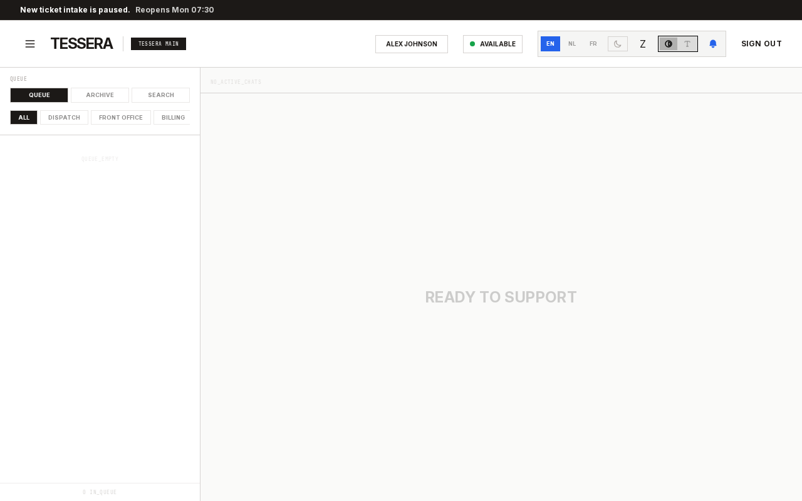
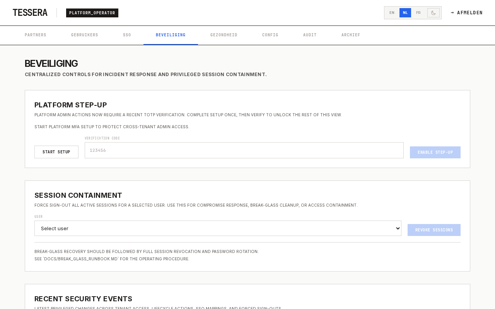

# Guichet

Real-time, multi-tenant chat platform for BPO and outsourced helpdesk teams. Each partner you serve is a scoped tenant; your agents handle their customers externally and use Guichet to get second-line help from in-house support. Built for speed, security, and simplicity.

## Features

- **Real-Time Chat** — Socket.io with Redis adapter for horizontal scaling, typing indicators, presence tracking, and collision detection
- **Multi-Tenant Architecture** — Strict isolation between tenants, platform-wide SSO with multi-tenant user memberships, and seamless workspace switching
- **Brutalist Design System** — Raw token-based UI (Zinc + accent colors), JetBrains Mono typography, and minimal functional motion
- **Role-Based Access** — Four roles (agent, support, admin, platform_operator) with granular permission gates
- **SSO-Only Authentication** — Azure Entra ID for all staff; partner employees federate in via Azure B2B guest invites (see `docs/superpowers/specs/partner-sso-b2b-guest.md`). No passwords, no MFA. Emergency access via the break-glass CLI (`server/scripts/break_glass.ts`).
- **Identity Model** — Single corporate identity per user across multiple tenant organizations with scoped roles per tenant. External guests (`users.isExternal`) are enforced single-partner and blocked from destructive partner-admin mutations via the `destructiveAdminProcedure` tRPC middleware.
- **Platform Cockpit** — Global operator view for tenant management, user provisioning, audit log, and archive browser
- **AI-Powered Support** — Message improvement, chat summarization, translation (nl/en/fr), and auto-summarize on close (Ollama / Azure OpenAI)
- **Security Hardening** — WORM audit archive (SHA-256 hash chain), session revocation, rotating refresh tokens with reuse detection, HttpOnly cookie auth, field-level encryption at rest for SMTP / mail-provider credentials
- **Audit Observability** — Chain-integrity verify UI with server-persisted history + CSV export for compliance attestation, multi-axis filtering (targetType / targetId / actor / date / partner), metadata drawer with diff view, cross-partner activity rollup, per-ticket audit drawer, chain-broken webhook side-channel. Alertmanager rules for tamper / staleness / silent emitters / GDPR purge misses. Runbook at `docs/AUDIT_RUNBOOK.md`.
- **Invite Flow** — Admin / support / agent invitable via SSO-provisioned flow (no passwords, no invite email). Pending-invite worklist with Revoke action; 30-day claim window; abandoned-invite purge; guest-removal revokes sessions + refresh tokens immediately.
- **SLA Management** — Per-tenant/department SLA targets with real-time countdown, breach alerts, and business hours support
- **GDPR Compliance** — 30-day retention purge with automatic archival, daily stats aggregation, and notification preferences. Purge observability via `guichet_gdpr_purge_runs_total{outcome}` and `guichet_gdpr_rows_purged_total{scope}`; aborts if the audit chain fails verification (fail-closed).
- **Canned Responses** — Per-partner templates with shortcut keys and `/` picker in chat
- **Customer Satisfaction** — Auto-prompted ratings on ticket close, follow-up reminders, per-agent CSAT reporting

## Screenshots

| Support View | Platform Admin |
|:---:|:---:|
|  |  |

## Tech Stack

| Layer | Technology |
|-------|-----------|
| Frontend | React 19, Vite 8, Tailwind CSS 4, Zustand 5 |
| Backend | Node.js 24 (ESM), Express 5, tRPC 11, Socket.io 4 |
| Database | PostgreSQL 18, Redis 8, Drizzle ORM |
| Observability | Prometheus, Grafana, Pino structured logging |
| Runtime | Docker & Docker Compose |

## Quick Start

```bash
# 1. Environment setup
cp .env.example .env

# 2. Start development
docker compose up

# 3. Clean database (truncate tables)
docker compose exec server npx tsx seed.ts
```

Open `http://localhost:3001`. Guichet uses SSO for partner authentication. For local development, you can log in as the platform operator to configure the system.

### First-Time Production Setup

On first startup with no platform operators, Guichet auto-creates one from environment variables:

```bash
PLATFORM_ADMIN_EMAIL=admin@yourcompany.com    # Required — this user logs in via SSO
```

### Production Deployment

```bash
docker compose -f docker-compose.prod.yml up
```

## Testing

```bash
# Unit tests
docker compose exec server npm test          # Server tests (Vitest)
docker compose exec client npm test          # Client tests (Vitest + jsdom)

# TypeScript
docker compose exec server npx tsc --noEmit
docker compose exec client npx tsc --noEmit

# E2E tests (Playwright — runs on host)
npx playwright test

# Local CI (all checks)
powershell -File scripts/ci.ps1
```

## Database Management

```bash
npm run db:migrate              # Apply pending migrations
npm run db:baseline             # Seed Drizzle ledger on existing DB (one-time)
npm run db:backup               # Backup to server/backups/ (gzipped, keeps last 10)
npm run db:backup:docker        # Same, from Docker container
```

## API Documentation

- **REST** — Swagger UI at `/api/v1/docs/`
- **tRPC** — Reference at `/api/v1/trpc-reference` (19 routers)

## Architecture

```
guichet/
├── server/          # Express + tRPC + Socket.io
│   ├── db/          # Drizzle ORM schema + connection
│   ├── trpc/        # tRPC router + domain routers
│   ├── socket/      # Real-time event handlers
│   ├── services/    # Business logic (AI, GDPR, archive, guards, mail)
│   └── middleware/   # Auth, validation
├── client/          # React + Vite + Tailwind
│   └── src/
│       ├── components/   # UI components by domain
│       ├── views/        # Page views (Platform, Admin, Support, Agent, Login)
│       ├── store/        # Zustand slices
│       └── hooks/        # Socket, i18n, store hooks
└── testing/         # k6 load tests + Playwright E2E
```

## License

Proprietary. All rights reserved.
