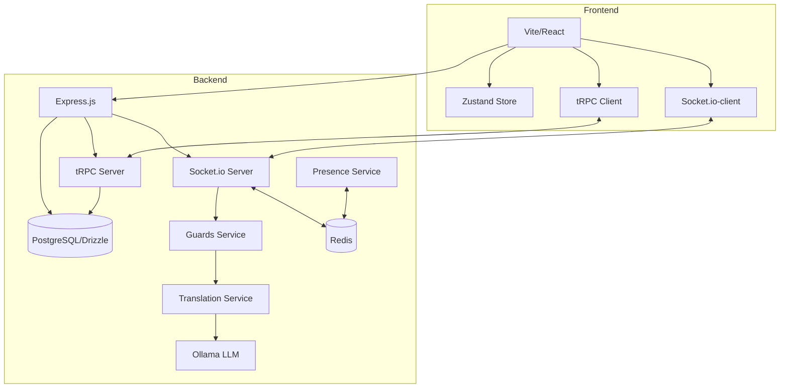
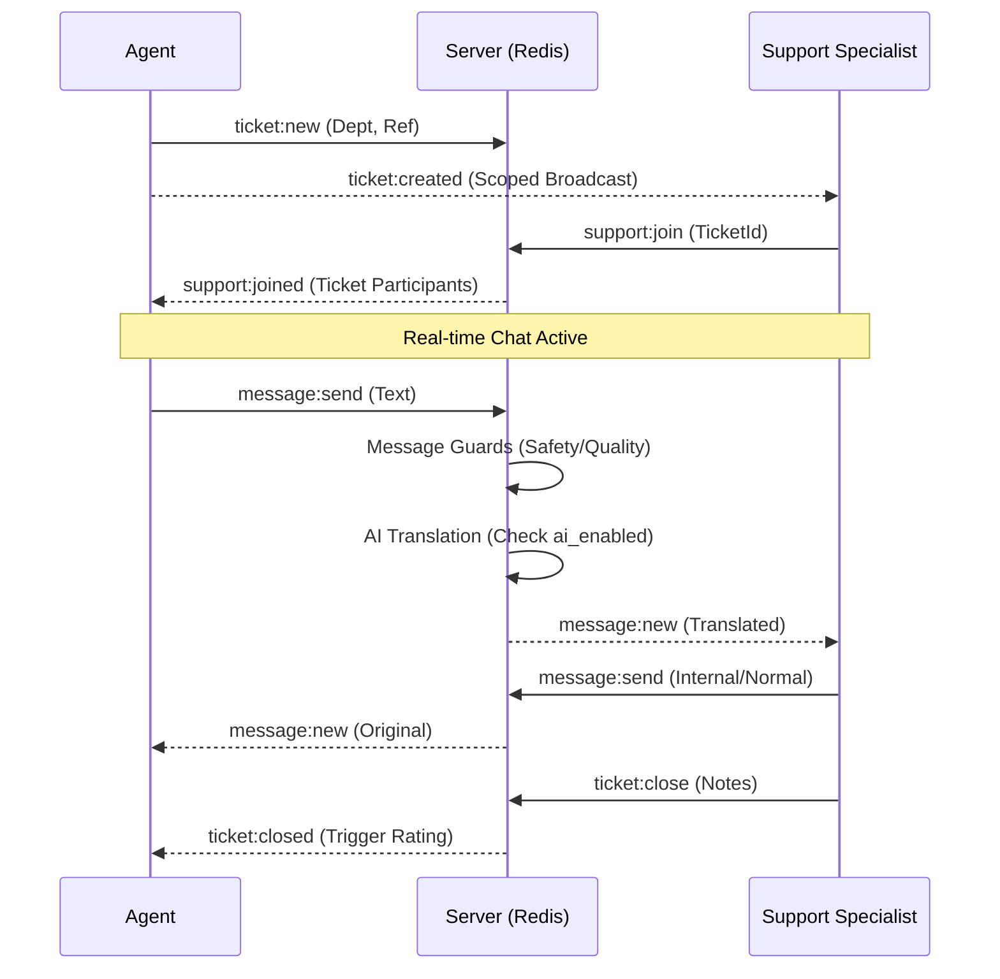

# Technical Documentation: Tessera

This document provides a comprehensive deep dive into the system design, tech stack, and multi-tenant architecture of the Tessera platform.

---

## 1. High-Level Architecture

The platform follows a real-time, event-driven, multi-tenant architecture designed for high availability and enterprise scalability.



### Core Technologies
| Layer | Technology |
|---|---|
| Frontend | React 18 + Vite 5 + Tailwind CSS 3 + Framer Motion |
| Communication | **tRPC** (Type-safe API) + Socket.io |
| Scaling | **Redis** (Socket.io Adapter + Distributed Presence) |
| State | Zustand |
| Backend | Node 20 (ESM), Express.js |
| Database | PostgreSQL + **Drizzle ORM** |
| Auth | JWT (Multi-Tenant Memberships) |
| AI | Ollama REST API (Model-agnostic per partner) |

---

## 2. Multi-Tenant Architecture

The platform is designed to be industry-agnostic ("White-Label"). Logic and data are isolated via a Partner/Membership model.

### The Membership Model
Instead of a static role on a user, access is managed via the `memberships` table. A single user can belong to multiple partners (projects) with different roles in each.

| Entity | Description |
|---|---|
| **Partner** | A "Tenant" (e.g., Telecom, Healthcare). Defines branding, labels, and AI rules. |
| **Membership** | Links a User to a Partner with a specific `role` and `dept`. |
| **User** | Global identity (Name, Lang). |

### Data Isolation
All database queries that touch tenant data (`tickets`, `daily_stats`, `ticket_labels`, `messages`, `canned_responses`) **must** include a `partner_id` filter. This is enforced by the `stats-tenant-isolation` test suite, which verifies that every SQL query in the stats router includes `partner_id` in both the WHERE clause and bind parameters.

### Tenant Manifest
Every partner has a JSON manifest that dynamically "hydrates" the UI:
- **Branding**: Primary/Secondary colors (`--brand-primary`).
- **Dynamic Palette**: Runtime generation of 10-shade Tailwind-compatible palettes (`brand-50` to `brand-900`) using piecewise linear HSL interpolation.
- **Labels**: Domain-specific terms (e.g., "Patient ID" vs "CDBID").
- **Departments**: Dynamic navigation tabs.
- **AI Rules**: Custom system instructions for the LLM.
- **Theme**: Custom CSS variables (blur, opacity, radius) with mode-aware defaults (Light/Dark).
- **Accessibility Modes**: Integrated specificity-based cascade for Dark, Dyslexic, and High-Contrast modes.

---

## 3. Real-Time Engine & Scalability

### Horizontal Scaling (Redis)
The platform is designed for enterprise scale (1000+ employees):
1. **Socket.io Redis Adapter**: Syncs chat events across multiple server instances.
2. **Distributed Presence**: Online user status is stored in **Redis Hashes** rather than local memory. This allows any server instance to know who is online globally.
3. **Message Lifecycle Events**:
    - `typing:start` / `typing:stop`: Dynamic visual indicators in the chat header.
    - `message:delivered`: Immediate confirmation for the sender.
    - `message:read`: Visual checkmark confirming the recipient has viewed the message.
4. **Message Normalization**: The `server/utils/messageMapper.ts` utility ensures that both tRPC and Socket.io endpoints return identical data structures, resolving historical issues with inconsistent case (snake_case vs camelCase) and missing translated text.
5. **Redis Utility**: Redis clients are managed via `server/utils/redis.ts` to ensure clean lifecycle management and prevent circular dependencies.
6. **Scoped Broadcasts**: Real-time updates (e.g., "Support Specialist joined") are scoped to `partner:{id}` rooms to minimize network overhead.

### Intelligent Incident Detection (Topic Heat)
A specialized background worker (`server/services/topicHeat.ts`) runs every 10 minutes to detect emerging incidents:
1. **Clustering**: Analyzes the first message of all tickets created in the last 15 minutes.
2. **LLM Analysis**: If a department exceeds a volume threshold (>3 tickets), ticket content is sent to the LLM with a specialized clustering prompt.
3. **Alert Generation**: If the AI detects a common theme (e.g., "login failure," "regional outage"), a record is created in `topic_alerts`.
4. **Real-Time Broadcast**: Alerts are broadcasted via Socket.io to the relevant `partner:{id}` room, triggering real-time UI notifications for admins and managers.

### Event Flow: Ticket Creation to Resolution



---

## 4. Database Schema

### Core Tables

```sql
partners           (id, name, industry, primary_color, secondary_color,
                    ref_1_label, ref_2_label, ai_rules, departments, ai_enabled,
                    agent_prompt_strategy, support_prompt_strategy, enable_actionable_ai,
                    theme_config, ollama_model, business_hours_start, business_hours_end,
                    business_hours_timezone)
users              (id, name, lang, password, avatar_url, is_platform_operator)
memberships        (id, user_id, partner_id, role, dept)
tickets            (id, partner_id, dept, agent_id, agent_name, agent_lang, 
                    ref_1, ref_2, status, support_id, support_name, 
                    support_lang, support_joined_at, created_at, closed_at, 
                    closing_notes, closed_by, participants, summary, reopened,
                    reopen_count)
messages           (id, ticket_id, sender_id, sender_name, sender_role, sender_lang,
                    text, translated_text, media_url, whisper, system, created_at, 
                    reactions, sentiment, canned_response_id)
ratings            (id, ticket_id, agent_id, support_id, rating, comment, created_at)
daily_stats        (date, partner_id, total, closed, abandoned, avg_response_ms, 
                    avg_duration_ms, avg_rating, sla_health, p95_response_ms, 
                    reopened, sentiment_sum, sentiment_count)
topic_alerts       (id, partner_id, dept, topic, summary, severity, 
                    ticket_count, status, created_at, resolved_at)
```

**JSON columns**: `participants`, `reactions`, `deptCounts`, `ratingsByDept`, `hourly`, `questions` are stored as JSON strings and parsed at query time.

---

## 5. API Design & Versioning

The platform uses a versioned API structure to ensure stability for clients and the mobile PWA.

### Namespace: `/api/v1`
All application logic is contained within the `v1` namespace. This allows for future breaking changes without interrupting service for older client versions.

- **tRPC Endpoint**: `/api/v1/trpc` — Main type-safe application logic.
- **REST Endpoints**:
    - `POST /api/v1/auth/login`: JWT-based authentication.
    - `GET /api/v1/config`: Dynamic client configuration (partner-aware).
    - `POST /api/v1/uploads`: Multer-based file upload with magic-byte validation.
    - `GET /api/v1/tickets/export`: CSV export for historical ticket data.
- **Health Check**: `/api/v1/health` — Deep health check (DB + LLM connectivity).

---

## 6. Observability (Prometheus + Grafana)

The platform exposes Prometheus metrics at `/metrics` via `prom-client`. 

### Access Control
Access to the `/metrics` endpoint is protected:
- **Local Access**: Requests from `127.0.0.1` or `::1` are permitted without a token.
- **Token Access**: External requests must provide a valid `x-metrics-token` header matching the `METRICS_TOKEN` environment variable.

### Metrics Exposed

| Metric | Type | Labels | Description |
|---|---|---|---|
| `http_request_duration_seconds` | Histogram | method, route, status | HTTP request latency |
| `http_requests_total` | Counter | method, route, status | Total HTTP requests |
| `socketio_connections_active` | Gauge | — | Active WebSocket connections |
| `socketio_events_total` | Counter | event | Socket.io events processed |
| `tickets_active_total` | Gauge | partner_id | Open/active tickets |
| `ticket_queue_depth` | Gauge | partner_id | Tickets awaiting support |
| `ai_pipeline_duration_seconds` | Histogram | type | AI pipeline call latency |
| `ai_pipeline_errors_total` | Counter | type | AI pipeline failures |

### Architecture
- **Metrics middleware** (`server/middleware/metrics.ts`): Instruments all HTTP requests.
- **Socket.io instrumentation**: Connection gauge + event counters in `server/socket/handlers.ts`.
- **AI pipeline timing**: Histogram wrapping Ollama calls in `server/services/translate.ts`.
- **Grafana dashboard**: Pre-provisioned 8-panel dashboard at `monitoring/grafana/dashboards/tessera.json`.

---

## 7. Data Lifecycle & Compliance (GDPR)

The platform enforces a 30-day data retention policy via the `gdpr.ts` service:

1. **Daily Purge Cycle**: A background job runs every 24 hours, scanning for records older than 30 days.
2. **Aggregation Before Deletion**: Before purging, ticket and message data is aggregated into the `daily_stats` table (counts, averages, sentiment sums) — preserving operational insights without PII.
3. **Transactional Safety**: The aggregation and deletion run inside a single Drizzle transaction to prevent data loss.
4. **What's Purged**: Messages, tickets, ratings, and translation cache entries older than the retention window.
5. **What's Kept**: Anonymized `daily_stats` rows, partner configuration, and user accounts (until explicit deletion request).
