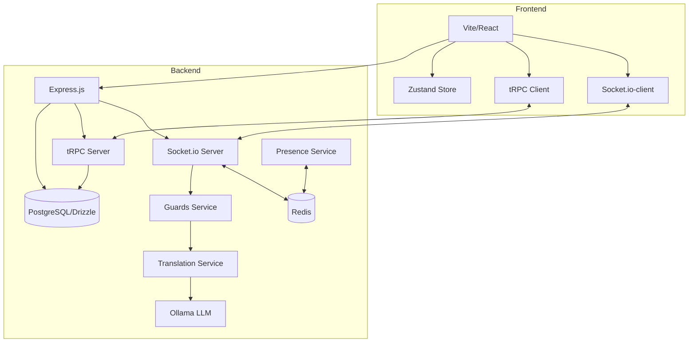
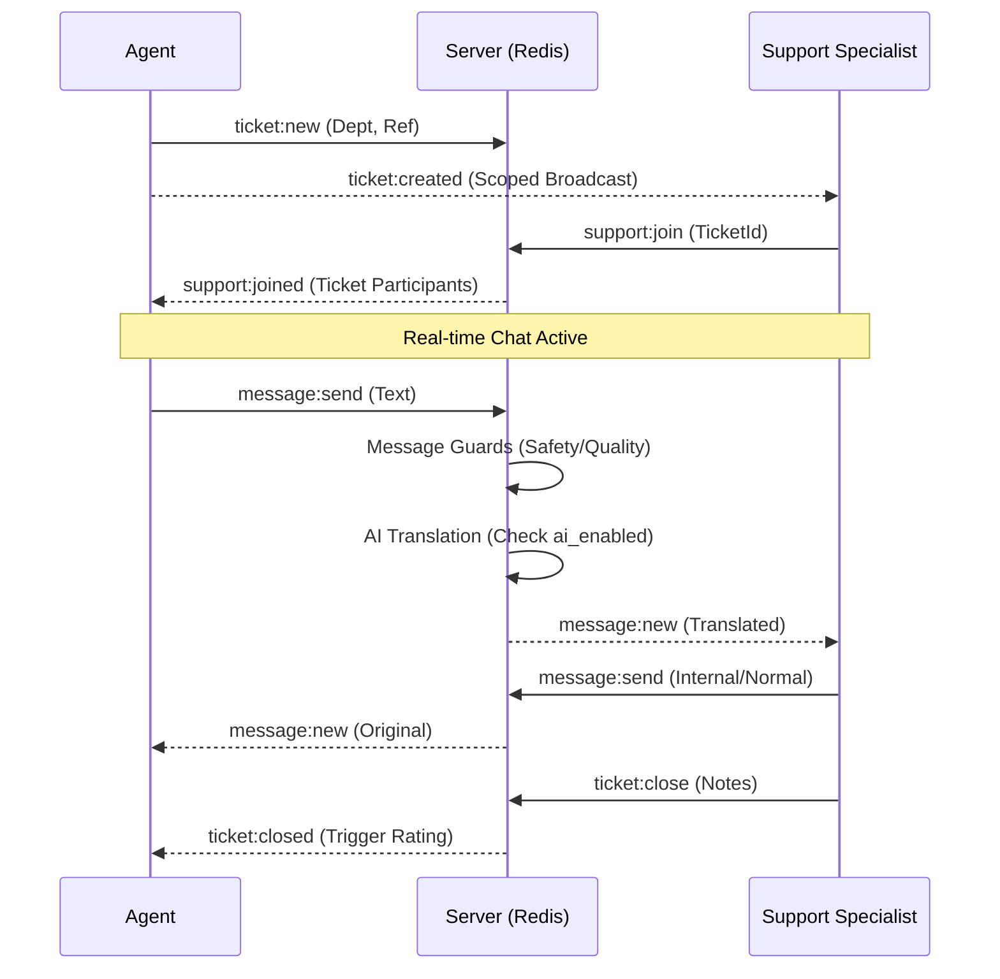

# Technical Documentation: M&P Support

This document provides a comprehensive deep dive into the system design, tech stack, and multi-tenant architecture of the M&P Support platform.

---

## 1. High-Level Architecture

The platform follows a real-time, event-driven, multi-tenant architecture designed for high availability and enterprise scalability.



### Core Technologies
| Layer | Technology |
|---|---|
| Frontend | React 18 + Vite 5 + Tailwind CSS 3 + Framer Motion |
| Communication | **tRPC** (Type-safe API) + Socket.io |
| Scaling | **Redis** (Socket.io Adapter + Distributed Presence) |
| State | Zustand |
| Backend | Node 20 (ESM), Express.js |
| Database | PostgreSQL + **Drizzle ORM** |
| Auth | JWT (Multi-Tenant Memberships) |
| AI | Ollama REST API (Tenant-Aware Pipeline) |

---

## 2. Multi-Tenant Architecture

The platform is designed to be industry-agnostic ("White-Label"). Logic and data are isolated via a Partner/Membership model.

### The Membership Model
Instead of a static role on a user, access is managed via the `memberships` table. A single user can belong to multiple partners (projects) with different roles in each.

| Entity | Description |
|---|---|
| **Partner** | A "Tenant" (e.g., Telecom, Healthcare). Defines branding, labels, and AI rules. |
| **Membership** | Links a User to a Partner with a specific `role` and `dept`. |
| **User** | Global identity (Name, Lang). |

### Tenant Manifest
Every partner has a JSON manifest that dynamically "hydrates" the UI:
- **Branding**: Primary/Secondary colors (`--brand-primary`).
- **Labels**: Domain-specific terms (e.g., "Patient ID" vs "CDBID").
- **Departments**: Dynamic navigation tabs.
- **AI Rules**: Custom system instructions for the LLM.

---

## 3. Real-Time Engine & Scalability

### Horizontal Scaling (Redis)
The platform is designed for enterprise scale (1000+ employees):
1. **Socket.io Redis Adapter**: Syncs chat events across multiple server instances.
2. **Distributed Presence**: Online user status is stored in **Redis Hashes** rather than local memory. This allows any server instance to know who is online globally.
3. **Scoped Broadcasts**: Real-time updates (e.g., "Expert joined") are scoped to `partner:{id}` rooms to minimize network overhead.

### Event Flow: Ticket Creation to Resolution



---

## 4. Database Schema

### Core Tables

```sql
partners           (id, name, industry, primary_color, secondary_color, 
                    ref_1_label, ref_2_label, ai_rules, departments, ai_enabled)
users              (id, name, lang, password, is_platform_operator)
memberships        (id, user_id, partner_id, role, dept)
tickets            (id, partner_id, dept, agent_id, agent_name, agent_lang, 
                    ref_1, ref_2, status, support_id, support_name, 
                    support_lang, support_joined_at, created_at, closed_at, 
                    closing_notes, closed_by, participants, summary)
messages           (id, ticket_id, sender_id, sender_name, text, translated_text, 
                    media_url, whisper, system, created_at, reactions, 
                    sentiment, canned_response_id)
ratings            (id, ticket_id, agent_id, support_id, rating, comment, created_at)
daily_stats        (date, partner_id, total, closed, abandoned, avg_response_ms, 
                    avg_duration_ms, avg_rating, sla_health, p95_response_ms, 
                    reopened, sentiment_sum, sentiment_count)
```

---

## 5. Security & Reliability

- **RBAC**: Multi-level roles (`platform_operator`, `admin`, `manager`, `support`, `agent`).
- **Data Isolation**: Mandatory `partner_id` scoping in all tRPC routers.
- **AI Toggles**: Partner-level `ai_enabled` flag to bypass LLM processing.
- **Observability**: Structured logging via **Pino** and distributed state via **Redis**.
