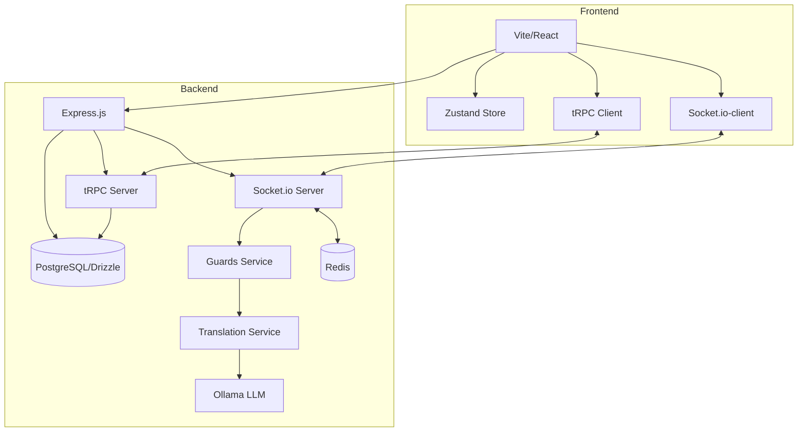
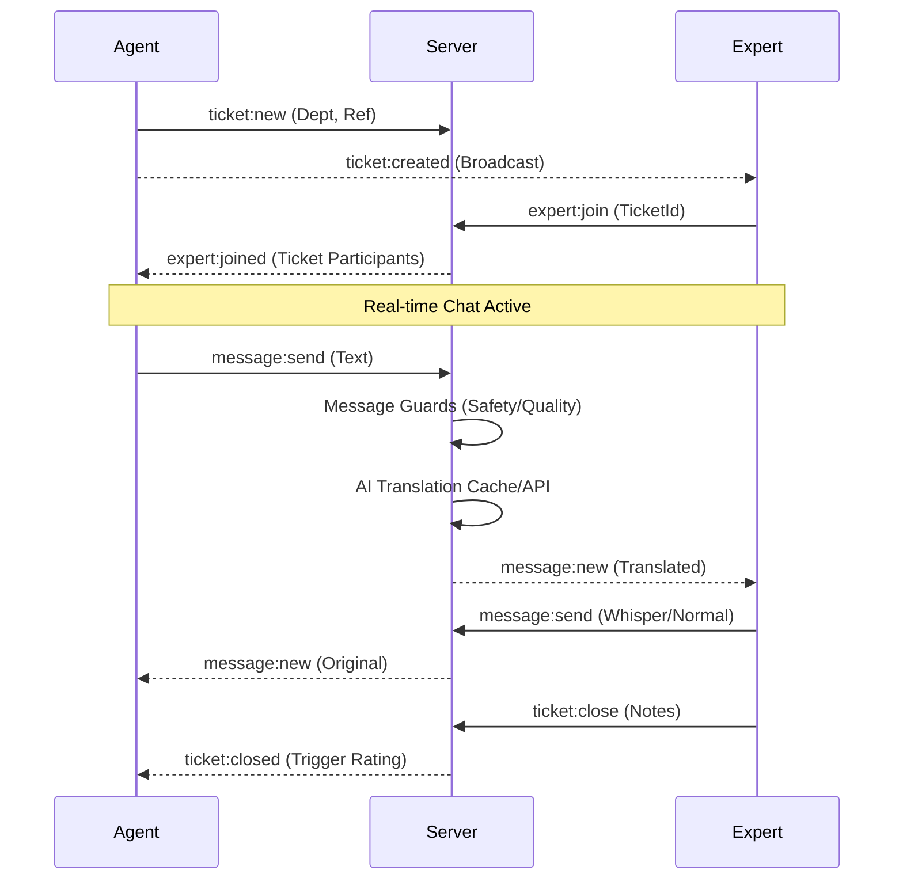

# Technical Documentation: M&P Support

This document provides a comprehensive deep dive into the system design, tech stack, and modular architecture of the M&P Support application.

---

## 1. High-Level Architecture

The application follows a real-time, event-driven architecture designed for high availability and low latency in customer support scenarios.



### Core Technologies
| Layer | Technology |
|---|---|
| Frontend | React 18 + Vite 5 + Tailwind CSS 3 + Framer Motion |
| Communication | **tRPC** (Type-safe API) + Socket.io |
| Scaling | **Redis** (Socket.io Adapter) |
| State | Zustand |
| Backend | Node 20 (ESM), Express.js |
| Database | PostgreSQL + **Drizzle ORM** |
| Auth | JWT (jsonwebtoken) + bcrypt |
| Logging | pino (+ pino-pretty in dev) |
| Translation | Ollama REST API (graceful fallback) |
| Charts | Recharts (admin dashboard) |

---

## 2. Real-Time Engine (Socket.io)

Real-time interactions are the core of the support experience. The server handles room management, broadcast logic, and background processing.

### Horizontal Scaling (Redis Adapter)
To support multi-instance deployments, the Socket.io server uses the `@socket.io/redis-adapter`. This ensures that events emitted on one instance (e.g., a new message) are broadcast to clients connected to all other instances via a shared **Redis** pub/sub backplane.

### Event Flow: Ticket Creation to Resolution



---

## 3. Modular Dashboard Architecture

The **Admin View** and **Expert View** use a highly modular "cockpit" approach.

### Dual Dashboard Orchestration
The Admin experience is split into two specialized interfaces:
- **Operational Dashboard**: Focused on real-time team performance, queue health, and staffing demand.
- **AI Intelligence Hub**: Dedicated to qualitative analysis, featuring sentiment trends, topic clustering, and LLM-powered conversation summaries.

### Immersive Zen Mode
The Expert interface includes a deeply immersive **Zen Mode** that leverages the Solaris design system:
- **Adaptive Glassmorphism**: High-blur, high-contrast visual isolation for active conversations.
- **Ambient Focus**: Slow-pulsing background gradients using `framer-motion` to reduce cognitive fatigue.
- **Automation**: Automatic triggering of Bionic Reading and notification shielding upon entry.

---

## 4. Database Schema

PostgreSQL via Drizzle ORM. Schema defined in `server/db/schema.ts`.

### Tables

```sql
users              (id, name, role, dept, lang, password)
tickets            (id, dept, agentId, agentName, agentLang, cdbId, dareRef, status, 
                    expertId, expertName, expertLang, expertJoinedAt, createdAt, 
                    closedAt, closingNotes, closedBy, participants, summary,
                    reopened, reopenCount)
messages           (id, ticketId, senderId, senderName, text, translatedText, 
                    mediaUrl, whisper, system, createdAt, deliveredAt, readAt, 
                    reactions, senderRole, senderLang, originalText, improvedText, 
                    processedText, translationSkipped, fallback, timestamp,
                    sentiment, cannedResponseId)
ratings            (id, ticketId, agentId, expertId, rating, comment, createdAt)
app_feedback       (id, userId, text, treated, createdAt)
labels             (id, name, color)
ticket_labels      (ticketId, labelId)          -- composite PK, ON DELETE CASCADE
daily_stats        (date, total, closed, abandoned, avgResponseMs, avgDurationMs,
                    avgRating, ratingCount, slaResolved, slaCompliant, 
                    deptCounts, ratingsByDept, hourly, p95ResponseMs,
                    reopened, sentimentSum, sentimentCount)
translations_cache (key, value, fromLang, toLang, createdAt)
llm_summaries      (period, sentiment, questions, summary, updatedAt)
canned_responses   (id, shortcut, text)
```

**JSON columns**: `participants`, `reactions`, `deptCounts`, `ratingsByDept`, `hourly`, `questions` are stored as JSON strings and parsed at query time.

---

## 5. Data Lifecycle & Compliance (GDPR)

The system manages a hybrid data model to balance historical analysis with privacy compliance.

1. **Live Data (Last 30 Days)**: All tickets, messages, and ratings are stored with full detail.
2. **Purge Cycle**: Every 24 hours, the server identifies "expired" data.
3. **Anonymized Aggregation**: Before deletion, key metrics (volumes, response times, ratings) are summarized into the `daily_stats` table.
4. **Permanent Storage**: `daily_stats` are retained indefinitely for long-term trend analysis.

---

## 6. Server Module Structure

| Module | File/Dir | Responsibility |
|---|---|---|
| App Setup | `app.ts` | Express middleware, health checks, Redis wiring |
| tRPC Router | `trpc/router.ts` | Root tRPC router (type-safe API) |
| Domain Routers | `trpc/routers/` | Routers for tickets, messages, stats, users, etc. |
| Socket Handlers | `socket/handlers.ts` | All real-time event handling (Socket.io) |
| Database | `db/schema.ts` | Drizzle ORM schema definition |
| Stats Service | `services/stats.ts` | Statistics computation logic |
| GDPR Service | `services/gdpr.ts` | Daily purge cycle with aggregation |
| Business Hours | `services/businessHours.ts` | Hours check, queue positions, agent status |
| Presence | `services/presence.ts` | Online user tracking |
| Translation | `services/translate.ts` | AI improve + translate pipeline |
| Guards | `services/guards.ts` | Message safety (regex + AI topic filter) |
| LLM | `services/llm.ts` | Sentiment analysis & conversation summaries |

---

## 7. Security & Reliability

- **RBAC**: All API routes require JWT authentication. Admin-only endpoints enforce additional role checks.
- **Magic Byte Validation**: Image uploads are verified via content headers to prevent spoofing.
- **Docker Orchestration**: Uses healthchecks and non-root runtimes for all containers.
- **Graceful Shutdown**: Handles SIGTERM/SIGINT to allow active requests to finish before closing DB pools.
