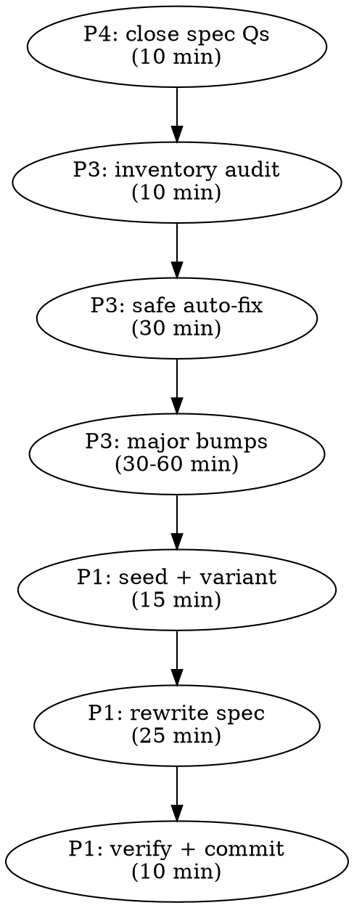

# Execution Plan — P4 → P3 → P1

**Date:** 2026-04-15
**Scope:** Close the SSO locale sync spec's open questions (P4), clear the security audit backlog (P3), restore `chat-enhancements.spec.ts` E2E coverage (P1). Parent plan: `2026-04-15-outstanding-followups-plan.md`.

Sequencing rationale: P4 is nearly free (paper work, 10 min). P3 is highest security value per hour. P1 restores CI green. Doing them in this order means every commit between now and "done" lands the codebase in a strictly better state.

---

## P4 — Close SSO locale sync spec open questions

**Goal:** `docs/superpowers/specs/2026-04-15-sso-locale-sync-design.md` no longer advertises unresolved design decisions.

### Steps

1. Read the current "Remaining open questions" section (bottom of the doc).
2. Rewrite each as a closed decision:
   - **Audit verbosity** — already implemented as "log only on actual `lang` change" via the `if (nextLang)` guard in `sso.ts`. Spec language: *"Decided: log only on transitions where `users.lang` actually changes. Claim matches current lang → no-op, no audit entry. Implemented in `sso.ts` line ~290."*
   - **`setLocale` rate limit** — none applied. Spec language: *"Decided: no rate limit. `setLocale` requires a manual UI click and carries no automated-abuse vector. Reconsider only if observed abuse patterns emerge."*
3. Move them from "Remaining open questions" into the existing "Decisions made" block.
4. Delete the "Remaining open questions" section if empty.
5. Commit: `docs(spec): close SSO locale sync open questions (audit verbosity, rate limit)`.

### Done criteria

- `grep -i "open question" docs/superpowers/specs/2026-04-15-sso-locale-sync-design.md` returns no matches.
- Design doc's final section is implementation order, not pending decisions.

**Time estimate: 10 minutes.**

---

## P3 — `npm audit fix` sweep

**Goal:** Zero high-severity and zero moderate vulnerabilities outstanding. Any remaining low-severity items explicitly justified in `SECURITY.md`.

### Steps

1. **Inventory.**
   ```
   docker compose exec -T server npm audit --json > /tmp/audit-server.json
   docker compose exec -T client npm audit --json > /tmp/audit-client.json
   ```
   Parse via `ctx_execute` → summary by severity + auto-fix availability (no paths into main context).

2. **Apply safe auto-fixes.**
   ```
   docker compose exec -T server npm audit fix
   docker compose exec -T client npm audit fix
   ```
   Run `docker compose exec -T server npm test` + `docker compose exec -T client npm test` after each to verify.
   Commit: `chore(deps): apply safe npm audit fixes (server + client)`.

3. **Re-audit.** If any high-severity remain, categorize:
   - **Transitive only, exploit path not applicable to our code** → document in `SECURITY.md` under `## Accepted risks` with CVE ID + rationale + next-review date.
   - **Fixable with `--force` (major version bump)** → do one package at a time:
     - Read the package changelog for breaking changes.
     - Apply the bump.
     - Run `scripts/ci.ps1 -Skip e2e,audit` (new build step included, confirms typecheck + tests + migrate + build all green).
     - Commit per package: `chore(deps): bump <pkg> <old>→<new> (fixes CVE-YYYY-NNNN)`.

4. **Update lockfiles.** `npm install` after each fix regenerates `package-lock.json`. Commit the lockfile together with the `package.json` change.

5. **Final verification.** `docker compose exec -T server npm audit --audit-level=high` + client equivalent return zero findings.

### Done criteria

- `npm audit --audit-level=high` zero findings on both server and client.
- Any accepted lower-severity risk documented in `SECURITY.md`.
- All tests still pass.

### Risk bounds

- **Low risk:** safe auto-fixes (semver-compatible).
- **Medium risk:** major-version bumps. Tested locally before commit, visible diffs in lockfile.
- **Revert plan:** `git revert <commit>` + re-install. Lockfile behavior is deterministic.

**Time estimate: 1–2 hours depending on how many forced bumps are involved.**

---

## P1 — Restore `chat-enhancements.spec.ts`

**Goal:** The 5 currently-failing `chat-enhancements` tests pass on a freshly seeded DB. No dependency on Lucas/Sophie production-like demo users.

### Steps

1. **Add fixture users in `server/seed.ts`.**
   ```ts
   // E2E test fixture pair — no pre-seeded tickets so tests can build
   // their own fixtures without colliding with the 1-ticket-per-agent
   // rule. Never used in demo-mode UI; purely for Playwright seeding.
   { id: 'support_qa',  name: 'QA Support', email: 'qa-support@acme.test', lang: 'en', role: 'support', departments: ['DSC', 'FOT', 'TEC'] },
   { id: 'agent_qa',    name: 'QA Agent',   email: 'qa-agent@acme.test',   lang: 'en', role: 'agent',   departments: [] },
   ```
   Update the seed summary console output accordingly.

2. **Re-run seed + confirm:**
   ```
   docker compose exec -T server npx tsx seed.ts
   docker compose exec -T db psql -U user -d guichet -c "SELECT id FROM users WHERE id IN ('support_qa','agent_qa')"
   ```

3. **Add `data-ticket-variant` attribute** on `QueueTicketRow` (value: `variant` prop — already `"queue" | "mine" | "other"`).
   ```tsx
   <li
     data-ticket-row
     data-ticket-variant={variant}
     ...
   >
   ```

4. **Update `chat-enhancements.spec.ts`:**
   - `loginAsDemo(page, 'support_qa')` instead of Lucas.
   - `seedOpenTicket` logs in as `agent_qa` (zero pre-seeded tickets → `ticket:new` succeeds).
   - `openFirstTicket` selector: `page.locator('li[data-ticket-row][data-ticket-variant="queue"]').first()` — deterministic, won't match "Other Agents" header or Lucas's assigned tickets.

5. **Verify:**
   ```
   npx playwright test chat-enhancements --reporter=line
   ```
   Expected: 5 tests pass (currently 5 failing), 6 skipped (unrelated — agent permission skips).

6. **Cross-check other specs.** Some specs may currently rely on Lucas's pre-seeded state. Search for `support_lucas` usage in `testing/e2e/` and confirm none break with the new `support_qa` addition (adding users doesn't remove Lucas).

7. **Commit:**
   - `test(seed): add support_qa + agent_qa fixture users for isolated E2E seeding`
   - `feat(support): data-ticket-variant attribute on QueueTicketRow for test selectors`
   - `test(e2e): rewrite chat-enhancements to use QA fixture users + variant selector`
   - Or squash all three into one: `test(e2e): restore chat-enhancements via dedicated QA fixture users`.

### Done criteria

- `npx playwright test chat-enhancements --reporter=line` shows 0 failures.
- `push-and-idle` still skips (that's P2, not in this plan).
- `sso-locale-sync` still passes (sanity check we didn't regress this morning's work).
- Total E2E status: 55+5 = 60+ passed, 6 skipped, 0 failed (`push-and-idle` skip branch is the correct behavior for now).

### Risk bounds

- **Low.** All changes are additive: new users in seed, new attribute on a React component, rewritten test selectors. Lucas and Sophie remain untouched for demo-mode UI.

**Time estimate: 50 minutes.**

---

## Overall sequencing



Single commit per logical unit. Each commit leaves main in a green state. Total ≈ 2.5 hours of focused work.

## Abort conditions

Stop and reassess if:
- Any forced npm bump in P3 breaks test suite in a way not fixable in 15 min → commit up to the safe-fix boundary, document the rest in `SECURITY.md` accepted-risks.
- P1 selector change affects other passing tests that depended on `li.cursor-pointer` → revert the selector change, re-approach with a scoped locator (`page.locator('[role="listitem"]').filter({...})`).
